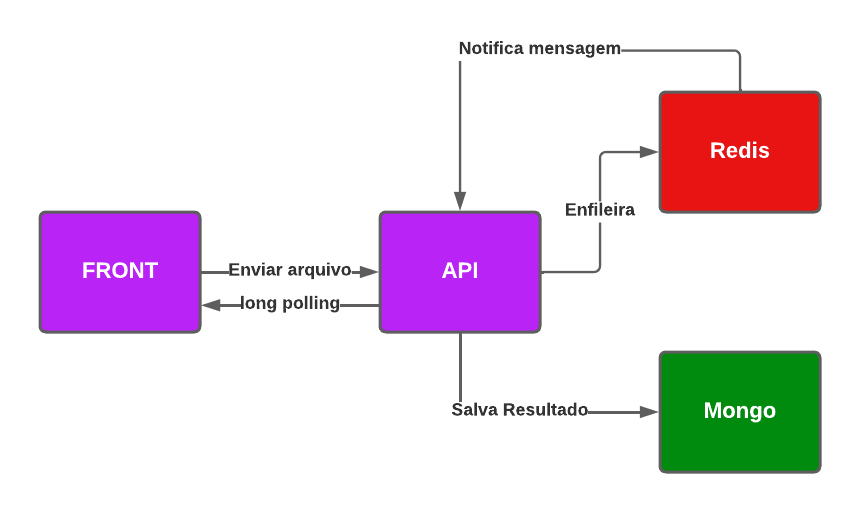

# Copybase Relatorios Back

## Descrição
Este e o backend do projeto, onde oferece uma api para importar arquivos csv e listar relatorios de SAAS como MRR e Churn Rate

## Tecnologias Utilizadas

- **Typescript**: Superset do javascript
- **NodeJS**: Runtime que roda javascript fora do navagador
- **Express**: Para subir um servidor http
- **Bull**: Para trabalhar com processamento de dados em fila
- **Multer**: Para upload de arquivos
- **Redis**: Banco de dados chave valor NoSQL que opera em memoria
- **MongoDB**: Banco de dados NoSQL que opera com documentos
- **Docker + Docker-Compose**: Para simular um ambiente de desenvolvimento

## Padrões
- **Clean Architecture**: Arquitetura limpa e desacoplada que permite a não dependencia de qualquer lib ou agente externo

## Arquitetura


## Como Rodar o Projeto

### Pré-requisitos
- Docker + Docker-Compose

### Configuração

Instruções passo a passo para configurar o projeto localmente. Por exemplo:

```bash
# Clone o repositório
git clone https://github.com/caduzindev/copybase-relatorios-back.git
cd copybase-relatorios-back

# Na raiz do projeto rode
docker-compose up -d

# Portas acessiveis
localhost:8081 -> Mongo Express
localhost:3005 -> API backend

# Para parar de rodar, na raiz do projeto
docker-compose down
